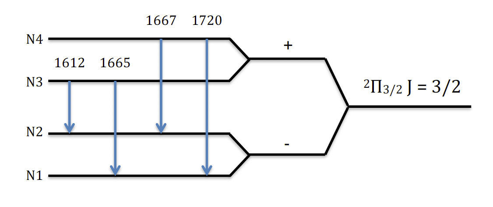

# Background

The gas and dust between the stars of the Milky Way -- the Galactic interstellar medium (ISM) -- provide the raw material for star formation in our galaxy. Stars form from the molecular hydrogen of the ISM, so observations of molecular gas are essential to our understanding of the star formation process. Unfortunately, molecular hydrogen does not have readily accessible energy levels at the low temperature and density of the molecular ISM rendering it effectively invisible. Other molecules expected to coexist with ${\rm H}_2$ are instead observed as 'tracers' of the molecular gas. The hydroxyl radical (OH) is one such tracer. The ground-rotational state of OH is split into 4 levels by $\Lambda$-doubling and hyperfine splitting, and there are 4 allowed transitions between those levels at 1612.231, 1665.402, 1667.359 and 1720.530 MHz. These levels and transitions are illustrated in Figure \ref{fig:OH_ground}.

## Radiative transfer

The OH in the molecular ISM is often observed by first identifying a bright source of radio continuum emission along the plane of the Milky Way, such as a bright HII region (within the Milky Way) or an active galactic nucleus (outside the Milky Way). The brightness of this continuum source $I_{\nu}$ is generally expressed as a 'brightness temperature' $T_{\rm c}$ defined by the Rayleigh-Jeans Law:

\begin{equation}
I_{\nu} = \frac{2\nu_0^2k_{{\rm B}}T_{\rm c}}{c^2}.
\label{Tc}
\tag{1}
\end{equation}

As the continuum radiation travels from the source to the observer, its intensity will be modified as it passes through intervening ISM clouds by a process of radiative transfer. If we assume only a single isothermal cloud along that line of sight, the observed brightness temperature $T_{\rm b}$ can then described by the following solution to the equation of radiative transfer:

\begin{equation}
T_{\rm b} = T_{\rm c}\,e^{-\tau_{\nu}} + T_{\rm bg}\,e^{-\tau_{\nu}} + T_{\rm ex}(1-e^{-\tau_{\nu}}),
\label{Tb}
\tag{2}
\end{equation}

where $T_{\rm ex}$ is the excitation temperature of the cloud for a given molecular transition, $\tau_{\nu}$ is the frequency-dependent optical depth of the cloud and $T_{\rm bg}$ is the background synchrotron and CMB radiation. Excitation temperature is a reparameterisation of the population of the energy levels of the given molecular transition, defined by the Boltzmann factor:

\begin{equation}
\frac{N_u}{N_l} = \frac{g_u}{g_l} e^{-\frac{h\nu_0}{k_{\rm B} T_{\rm ex}}},
\label{Tex}
\tag{3}
\end{equation}

where $N_u$ and $N_l$ are the column density in the upper and lower levels of the transition, $g_u$ and $g_l$ are the degeneracies of the upper and lower levels, and $\nu_0$ is the rest frequency of the transition. Optical depth is defined by:

\begin{equation}
\tau_{\nu}=\frac{c^2}{8\pi \nu^2_0} \frac{g_u}{g_l}\,N_l\,A_{ul} \Big(1-e^{\frac{-h\nu_0}{k_{\mathrm{B}} T_\mathrm{ex}}}\Big)\,\phi(\nu),
\label{tau}
\tag{4}
\end{equation}

where $A_{ul}$ is the Einstein $A$ coefficient and $\phi(\nu)$ is the spectral line profile.

If multiple ISM clouds lie along the sightline between the observer and the background continuum source, it is likely that they will have slightly different line-of-sight velocities relative to the observer, such that their spectral line profiles will be Doppler-shifted to slightly different frequencies. These shifts in frequency are generally less than the spacing between the ground-rotational state transitions of OH, except for at the Galactic centre. Therefore, an individual spectral observation of OH will target one of the ground-rotational state transitions by measuring brightness temperature vs frequency for a range of expected Doppler-shifted frequencies around its rest-frequency. The frequency axis of the spectrum can then be reparameterised to velocity. Radio telescopes such as the Australia Telescope Compact Array (ATCA) and the Arecibo Observatory Radio Telescope are able to observe the spectra of all four OH ground-rotational states simultaneously, resulting in four brightness temperature vs velocity spectra for a given line-of-sight. Any ISM clouds along that line-of-sight may then be expected to result in a spectral line feature in all four spectra at the same velocity and with the same velocity width but with brightness temperatures based on their respective $T_{\rm ex}$ and $\tau$. These spectral line features are generally broadened by Gaussian processes, so by decomposing the observed spectra into individual Gaussian components, the $T_{\rm ex}$ and $\tau$ of individual isothermal clouds can be recovered. From this the populations of the four levels of the ground-rotational state can be inferred, and molecular excitation modelling can be used to propose the physical characteristics of those clouds such as local gas temperature, density or radiative environment. These characteristics can then constrain models of star formation, increasing our understanding of our Galaxy.

However, the process of Gaussian decomposition that is the crucial first step in the analysis of OH observations is highly non-trivial. Amoeba employs a Bayesian approach to Gaussian decomposition, resulting in an objective and statistically robust identification of individual clouds along the line-of-sight.

## Bayesian Gaussian decomposition

Bayesian statistics is based on Bayes' Theorem:

\begin{equation}
{\rm P}(\boldsymbol{\theta}|\boldsymbol{d}, \mathcal{M}) = \frac{{\rm P}(\boldsymbol{d}|\boldsymbol{\theta}, \mathcal{M})~{\rm P}(\boldsymbol{\theta}|\mathcal{M})}{{\rm P}(\boldsymbol{d}|\mathcal{M})},
\label{Bayes}
\tag{5}
\end{equation}

where the posterior probability ${\rm P}(\boldsymbol{\theta}|\boldsymbol{d}, \mathcal{M})$ is the probability that a model $\mathcal{M}$ with parameters $\boldsymbol{\theta}$ fits a set of data $\boldsymbol{d}$. In the context of Amoeba, a model is defined by the number of isothermal clouds in the sampled velocity range along the line of sight. Each of these clouds will result in a Gaussian-shaped feature in each of the four OH ground-rotational state spectra. This feature will be centred at the systemic velocity $v$ of the cloud and have the same full width at half-maximum $\Delta v$ (defined by the velocity dispersion of the cloud) in each of the four spectra. The peak brightness temperature in each of the four spectra are determined by the column densities of the four levels of the ground-rotational state ($N1, N2, N3, N4$). Thus a model $\mathcal{M}_i$ defined as there being $i$ isothermal clouds along the line-of-sight will have parameters: 

\begin{equation}
\boldsymbol{\theta}_i = (v_1, \Delta v_1, N1_1, N2_1, N3_1, N4_1, ..., v_i, \Delta v_i, N1_i, N2_i, N3_i, N4_i).
\label{theta}
\tag{6}
\end{equation}

The posterior probability is informed by the 'likelihood' ${\rm P}(\boldsymbol{d}|\boldsymbol{\theta}, \mathcal{M})$ (i.e., how well the data fits the model), and the 'prior' information about the probability of the model parameters ${\rm P}(\boldsymbol{\theta}|\mathcal{M})$, as well as the probability of the data given the model ${\rm P}(\boldsymbol{d}|\mathcal{M})$. If the uncertainties on the data are well described by Gaussian statistical noise, then the likelihood is directly related to the $\chi$ statistic via ${\rm P}(\boldsymbol{d}|\boldsymbol{\theta}, \mathcal{M}) = -\chi^2/2$.

Two competing models -- i.e. one with $i$ Gaussian components and one with $j$ -- can then be compared by computing the ratio of their posterior probabilities, known as the 'Bayes Factor':

\begin{equation}
K = \frac{P(\boldsymbol{d}|\mathcal{M}_i)}{P(\boldsymbol{d}|\mathcal{M}_j)} = \frac{\int P(\boldsymbol{\theta_i}| \mathcal{M}_i)~P(\boldsymbol{d}|\boldsymbol{\theta_i}, \mathcal{M}_i)~d\boldsymbol{\theta_i}}{\int P(\boldsymbol{\theta_j}| \mathcal{M}_j)~P(\boldsymbol{d}|\boldsymbol{\theta_j}, \mathcal{M}_j)~d\boldsymbol{\theta_j}} = \frac{P(\mathcal{M}_i|\boldsymbol{d})~P(\mathcal{M}_j)}{P(\mathcal{M}_j|\boldsymbol{d})~P(\mathcal{M}_i)}.
\label{BF}
\tag{7}
\end{equation}

Amoeba uses the Python implementation of Goodman \& Weare's Affine Invariant Markov chain Monte Carlo (MCMC) Ensemble sampler 'emcee' [@Foreman-Mackey2013] to sample the posterior probability distribution of the models $\mathcal{M}_i$ and $\mathcal{M}_j$, and hence to numerically evaluate the integrals required to compute the Bayes Factor.

# Using Amoeba

Amoeba takes as input a set of OH optical depth spectra $\tau(v)$, and a set of expected brightness temperature spectra $T_{\rm exp}(v)$. These two sets of spectra are obtained by measuring the brightness temperature towards the bright background continuum source (the 'on-source' observations), and in a pattern surrounding the continuum source (the 'off-source' observations) following, for example, the method outlined by @Heiles2003. The 'on-' and 'off-source' brightness temperatures are defined as:

\begin{equation}
T_{\rm b}^{\rm on} = T_{\rm c}\,e^{-\tau_{\nu}} + T_{\rm bg}\,e^{-\tau_{\nu}} + T_{\rm ex}(1-e^{-\tau_{\nu}}),\\
T_{\rm b}^{\rm off} = T_{\rm bg}\,e^{-\tau_{\nu}} + T_{\rm ex}(1-e^{-\tau_{\nu}}).
\label{on_off}
\tag{8}
\end{equation}

From these observations, the optical depth spectra $\tau(v)$ and brightness temperature spectra $T_{\rm exp}(v)$ are obtained:

\begin{equation}
T_{\rm exp}(v) = T_{\rm b}^{\rm off},\\
\tau(v) = -{\rm ln} (\frac{T_{\rm b}^{\rm on}-T_{\rm b}^{\rm off}}{T_{\rm c}}).
\label{Texp_tau}
\tag{9}
\end{equation}

Amoeba can also take as input a set of OH optical depth spectra only. In this case a model $\mathcal{M}_i$ with $i$ isothermal clouds along the line-of-sight will have parameters: 

\begin{equation}
\boldsymbol{\theta}_i = (v_1, \Delta v_1, \tau_1(1612), \tau_1(1667), \tau_1(1720), ..., v_i, \Delta v_i, \tau_i(1612), \tau_i(1667), \tau_i(1720)).
\label{theta2}
\tag{10}
\end{equation}

The value of $\tau(1665)$ is obtained from the optical depth sum-rule:

\begin{equation}
\tau(1612) + \tau(1720) = \frac{\tau(1665)}{5} + \frac{\tau(1667)}{9}.
\label{sum}
\tag{11}
\end{equation}

Amoeba also allows input of an arbitrary number of spectra to be fit simultaneously. In this case the parameters will be centroid velocity $v$, full width at half-maximum $\Delta v$ and the Gaussian height for each of the provided spectra.

# References